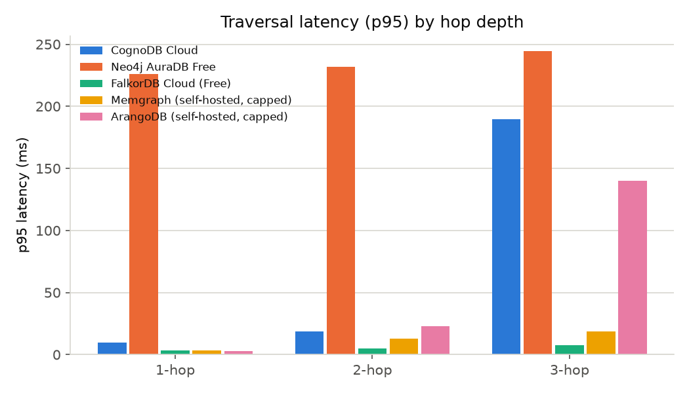
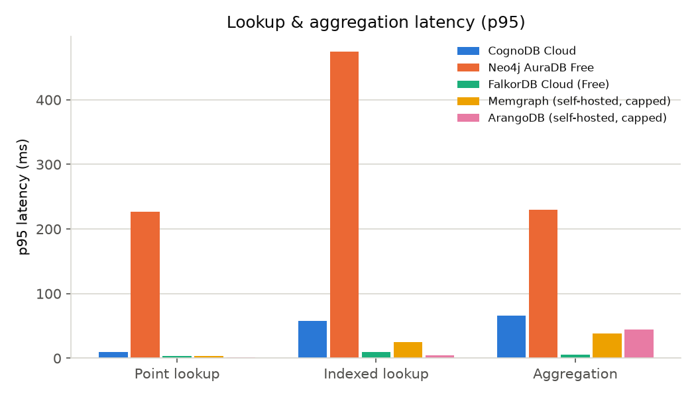
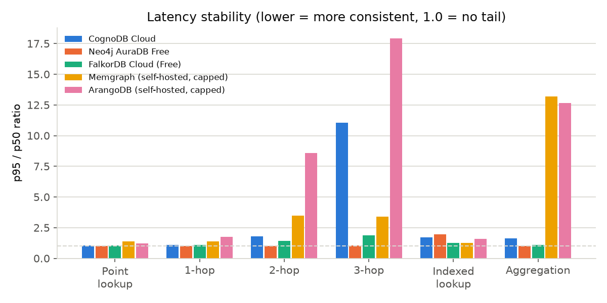
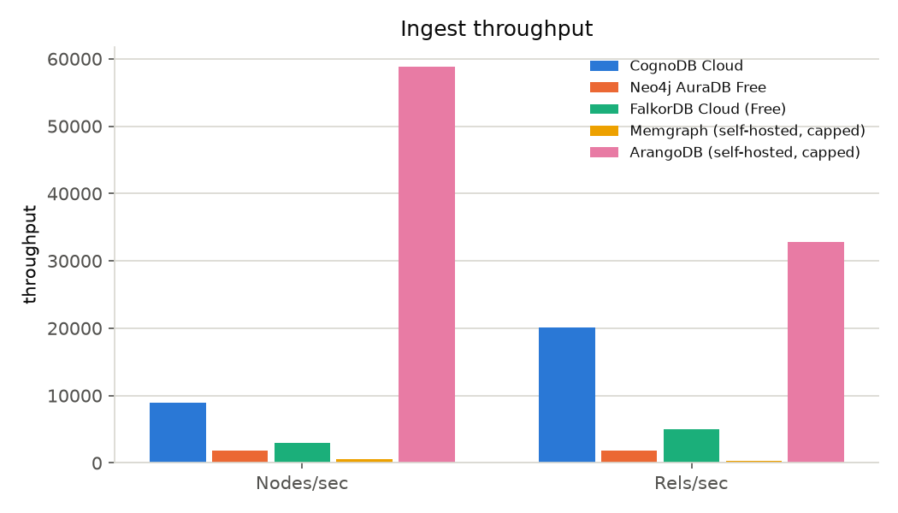
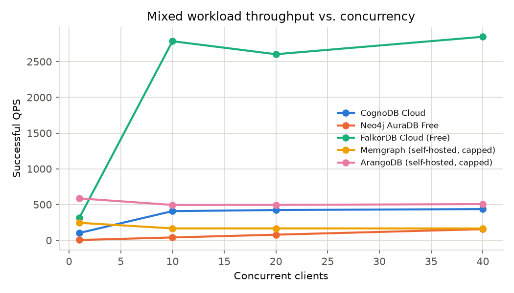
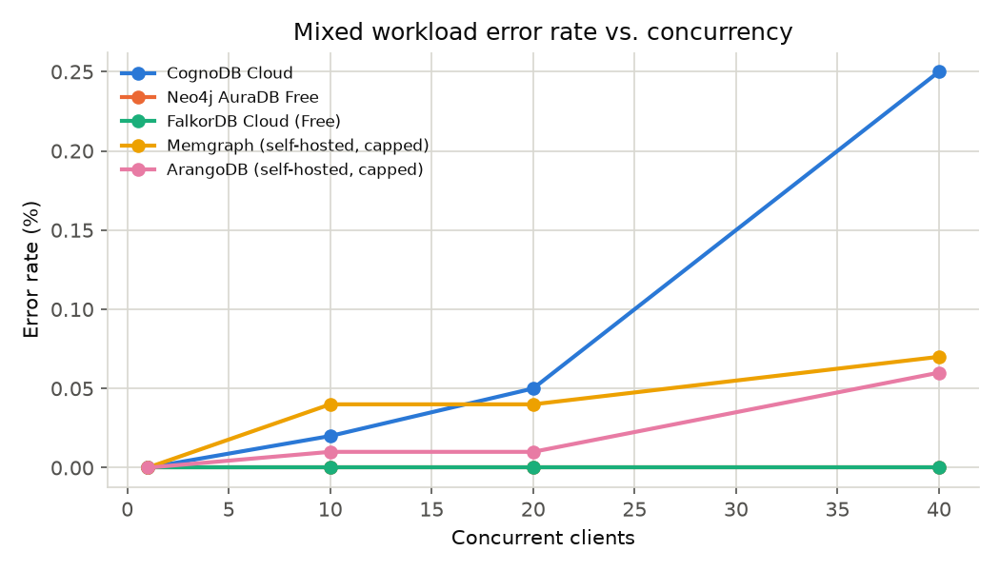

# Results

Generated by `python -m scripts.generate_report`. Do not hand-edit — edit the harness and re-run.

> **Fairness note:** Managed free tiers do not expose identical underlying hardware; self-hosted comparators (Memgraph, ArangoDB) were explicitly CPU/RAM-capped to match CognoDB's provisioned instance instead of left unconstrained. Results are workload- and resource-tier-specific, not a universal ranking of these databases — see the README methodology and caveats before drawing broader conclusions.

## Platform specs

| Platform | Deployment | Driver | Query language | vCPU | RAM | Disk |
|---|---|---|---|---|---|---|
| CognoDB Cloud | managed-free-tier | bolt | Cypher | 0.5 (burstable) | 512 MB | 1 GB |
| Neo4j AuraDB Free | managed-free-tier | bolt | Cypher | not disclosed (shared) | not disclosed (Neo4j caps by node/rel count, not RAM) | not disclosed |
| FalkorDB Cloud (Free) | managed-free-tier | falkordb | Cypher (openCypher subset) | shared | 100 MB | shared (RAM-backed) |
| Memgraph (self-hosted, capped) | self-hosted-capped | bolt | Cypher (openCypher) | 0.5 (docker --cpus=0.5, matches CognoDB) | 512 MB (docker -m 512m, matches CognoDB) | host-backed, not quota-limited; benchmark dataset kept below 1 GB |
| ArangoDB (self-hosted, capped) | self-hosted-capped | arangodb | AQL | 0.5 (docker --cpus=0.5, matches CognoDB) | 512 MB (docker -m 512m, matches CognoDB) | host-backed, not quota-limited; benchmark dataset kept below 1 GB |

## Dataset

- Source: SNAP cit-HepPh (https://snap.stanford.edu/data/cit-HepPh.html)
- Sampling method: forest-fire (Leskovec & Faloutsos 2006) (seed=42, 13 fire restarts)
- Sample graph: **8,769 nodes / 105,000 relationships**, avg degree 23.948, 1 connected component
- Year property: 8,047 papers with a real recorded year, 722 without (no synthetic years — see caveats)
- `nodes.csv` sha256: `4cfc8db8f1e196099a74ed80347e1bf9170b4619d66d714200044ec930747dbe`
- `edges.csv` sha256: `17de749956ab6dc7969b145b6921926dcc7301ed2977c36a369ea50a2d5b7dc7`
  (fingerprints of the processed dataset actually used to generate this report — regenerate via `make dataset` and diff against these to confirm you reproduced the exact same graph)

## Run status

| Platform | Status | Client env | Timestamp (UTC) | Error |
|---|---|---|---|---|
| CognoDB Cloud | ok | github-codespaces | 2026-08-20T18:06:38.278072+00:00 |  |
| Neo4j AuraDB Free | ok | github-codespaces | 2026-08-20T18:11:22.766372+00:00 |  |
| FalkorDB Cloud (Free) | ok | github-codespaces | 2026-08-20T14:03:34.295831+00:00 |  |
| Memgraph (self-hosted, capped) | ok | github-codespaces | 2026-08-20T18:01:37.354189+00:00 |  |
| ArangoDB (self-hosted, capped) | ok | github-codespaces | 2026-08-20T17:54:59.233553+00:00 |  |

## Data loading

| Platform | Nodes/sec | Rels/sec | Total load time (s) | Load verified |
|---|---|---|---|---|
| CognoDB Cloud | — | — | — | — |
| Neo4j AuraDB Free | — | — | — | — |
| FalkorDB Cloud (Free) | — | — | — | — |
| Memgraph (self-hosted, capped) | — | — | — | — |
| ArangoDB (self-hosted, capped) | — | — | — | — |

## 1-hop traversal latency

| Platform | p50 (ms) | p95 (ms) | n |
|---|---|---|---|
| CognoDB Cloud | 9.1 | 9.9 | 150 |
| Neo4j AuraDB Free | 225.3 | 226.3 | 150 |
| FalkorDB Cloud (Free) | 3.3 | 3.6 | 150 |
| Memgraph (self-hosted, capped) | 2.6 | 3.6 | 150 |
| ArangoDB (self-hosted, capped) | 1.7 | 2.9 | 150 |

## 2-hop traversal latency

| Platform | p50 (ms) | p95 (ms) | n |
|---|---|---|---|
| CognoDB Cloud | 10.2 | 18.4 | 150 |
| Neo4j AuraDB Free | 226.2 | 231.9 | 150 |
| FalkorDB Cloud (Free) | 3.5 | 5.0 | 150 |
| Memgraph (self-hosted, capped) | 3.6 | 12.6 | 150 |
| ArangoDB (self-hosted, capped) | 2.7 | 22.8 | 150 |

## 3-hop traversal latency

| Platform | p50 (ms) | p95 (ms) | n |
|---|---|---|---|
| CognoDB Cloud | 17.2 | 189.6 | 150 |
| Neo4j AuraDB Free | 228.6 | 244.6 | 150 |
| FalkorDB Cloud (Free) | 4.1 | 7.8 | 150 |
| Memgraph (self-hosted, capped) | 5.5 | 18.6 | 150 |
| ArangoDB (self-hosted, capped) | 7.8 | 140.2 | 150 |

## Point lookup latency

| Platform | p50 (ms) | p95 (ms) | n |
|---|---|---|---|
| CognoDB Cloud | 8.8 | 9.4 | 150 |
| Neo4j AuraDB Free | 224.9 | 226.5 | 150 |
| FalkorDB Cloud (Free) | 3.2 | 3.4 | 150 |
| Memgraph (self-hosted, capped) | 2.3 | 3.2 | 150 |
| ArangoDB (self-hosted, capped) | 1.0 | 1.2 | 150 |

## Indexed/filtered lookup latency (WHERE year = ...)

| Platform | p50 (ms) | p95 (ms) | n |
|---|---|---|---|
| CognoDB Cloud | 33.6 | 58.2 | 150 |
| Neo4j AuraDB Free | 244.0 | 474.9 | 150 |
| FalkorDB Cloud (Free) | 7.3 | 9.2 | 150 |
| Memgraph (self-hosted, capped) | 19.6 | 24.5 | 150 |
| ArangoDB (self-hosted, capped) | 3.0 | 4.9 | 150 |

## Aggregation latency (count of Paper grouped by year)

| Platform | p50 (ms) | p95 (ms) | n |
|---|---|---|---|
| CognoDB Cloud | 40.4 | 66.2 | 150 |
| Neo4j AuraDB Free | 227.5 | 229.8 | 150 |
| FalkorDB Cloud (Free) | 5.3 | 5.7 | 150 |
| Memgraph (self-hosted, capped) | 2.9 | 38.1 | 150 |
| ArangoDB (self-hosted, capped) | 3.5 | 44.3 | 150 |

## Mixed read/write workload (concurrency sweep)

80% read / 20% write mix (60s per concurrency level, see README methodology for exact op composition).

| Platform | Concurrency | Valid run | QPS (successful) | Error rate | Workers connected |
|---|---|---|---|---|---|
| CognoDB Cloud | 1 | True | 102.09 | 0.00% | 1/1 |
| CognoDB Cloud | 10 | True | 407.92 | 0.02% | 10/10 |
| CognoDB Cloud | 20 | True | 422.97 | 0.05% | 20/20 |
| CognoDB Cloud | 40 | True | 436.57 | 0.25% | 40/40 |
| Neo4j AuraDB Free | 1 | True | 3.91 | 0.00% | 1/1 |
| Neo4j AuraDB Free | 10 | True | 39.20 | 0.00% | 10/10 |
| Neo4j AuraDB Free | 20 | True | 78.12 | 0.00% | 20/20 |
| Neo4j AuraDB Free | 40 | True | 155.45 | 0.00% | 40/40 |
| FalkorDB Cloud (Free) | 1 | True | 314.88 | 0.00% | 1/1 |
| FalkorDB Cloud (Free) | 10 | True | 2785.74 | 0.00% | 10/10 |
| FalkorDB Cloud (Free) | 20 | True | 2603.51 | 0.00% | 20/20 |
| FalkorDB Cloud (Free) | 40 | True | 2847.71 | 0.00% | 40/40 |
| Memgraph (self-hosted, capped) | 1 | True | 244.14 | 0.00% | 1/1 |
| Memgraph (self-hosted, capped) | 10 | True | 166.27 | 0.04% | 10/10 |
| Memgraph (self-hosted, capped) | 20 | True | 166.30 | 0.04% | 20/20 |
| Memgraph (self-hosted, capped) | 40 | True | 165.32 | 0.07% | 40/40 |
| ArangoDB (self-hosted, capped) | 1 | True | 585.89 | 0.00% | 1/1 |
| ArangoDB (self-hosted, capped) | 10 | True | 494.69 | 0.01% | 10/10 |
| ArangoDB (self-hosted, capped) | 20 | True | 495.01 | 0.01% | 20/20 |
| ArangoDB (self-hosted, capped) | 40 | True | 506.24 | 0.06% | 40/40 |

## Footprint

| Platform | Nodes | Edges | Notes |
|---|---|---|---|
| CognoDB Cloud | 8769 | 105000 | Byte-level storage size is not exposed over Bolt on this platform's free tier; see the platform console/dashboard. |
| Neo4j AuraDB Free | 8769 | 105000 | Byte-level storage size is not exposed over Bolt on this platform's free tier; see the platform console/dashboard. |
| FalkorDB Cloud (Free) | 8769 | 105000 | FalkorDB Cloud free tier does not expose per-graph memory usage over the client API. |
| Memgraph (self-hosted, capped) | 8769 | 105000 | Container capped at 0.5 CPU / 512 MB (see Platform specs); byte-level graph storage not separately reported in this run. |
| ArangoDB (self-hosted, capped) | 8769 | 105000 | Container capped at 0.5 CPU / 512 MB (see Platform specs); byte-level graph storage not separately reported in this run. |

## Winner by workload

| Workload | Winner | Value |
|---|---|---|
| Point lookup (p95) | ArangoDB (self-hosted, capped) | 1.23 ms |
| Indexed lookup (p95) | ArangoDB (self-hosted, capped) | 4.87 ms |
| 1-hop traversal (p95) | ArangoDB (self-hosted, capped) | 2.92 ms |
| 2-hop traversal (p95) | FalkorDB Cloud (Free) | 5.03 ms |
| 3-hop traversal (p95) | FalkorDB Cloud (Free) | 7.78 ms |
| Aggregation (p95) | FalkorDB Cloud (Free) | 5.70 ms |
| Ingest throughput (nodes/sec) | — | no data |
| Ingest throughput (rels/sec) | — | no data |
| Mixed workload QPS @ 1 clients | ArangoDB (self-hosted, capped) | 585.89 qps |
| Mixed workload QPS @ 10 clients | FalkorDB Cloud (Free) | 2785.74 qps |
| Mixed workload QPS @ 20 clients | FalkorDB Cloud (Free) | 2603.51 qps |
| Mixed workload QPS @ 40 clients | FalkorDB Cloud (Free) | 2847.71 qps |

_These are winners only for this specific dataset, query set, and resource-capped setup — not a general claim about which database is "best." A different dataset size, query mix, or hardware tier could change every row._

## Charts

See also: [`dashboard.html`](dashboard.html) for a browsable summary, or `results/raw/*.json` for the full per-platform data behind every table above.
